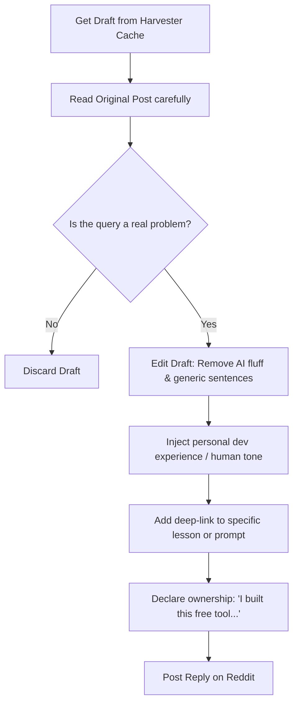
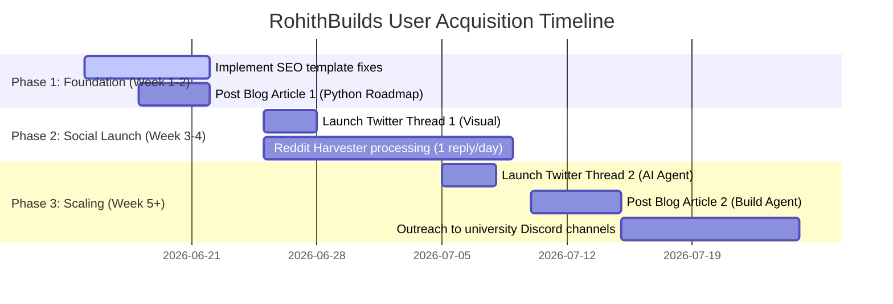

# RohithBuilds: Growth & Distribution Playbook
*A Strategic Blueprint to Scale from 10 to 1,000+ Active Users*

---

## 1. Target Developer Communities

To scale RohithBuilds, user acquisition should focus on spaces where Python beginners, student developers, and AI enthusiasts look for resources. 

### A. Curated Subreddits
These communities are ideal for organic answers and plugging RohithBuilds courses, prompts, and job boards.

| Subreddit | Size (Approx.) | Target Persona | Best RohithBuilds Feature to Plug |
| :--- | :--- | :--- | :--- |
| **r/learnprogramming** | 4.1M+ | Absolute beginners, career switchers | 100-Day Python to AI course, Rohi AI Tutor |
| **r/learnpython** | 850k+ | Python learners seeking help | 100-Day Course lessons, code challenges |
| **r/LocalLLaMA** | 185k+ | Intermediate developers building locally | 7-Day AI Agent course, Prompts for system design |
| **r/ChatGPTCoding** | 520k+ | Developers using AI to write code | Prompt Vault, /improve tool, AI Agent building |
| **r/cscareerquestionsIN**| 120k+ | Indian tech students & freshers | Jobs board (batch filters 2025/2026/2027), AI Resume match |
| **r/developer** | 60k+ | Junior and mid-level programmers | Prompt Vault, daily job curation, /improve tool |
| **r/developersIndia** | 350k+ | Indian developers and students | Free Python to AI roadmap, /jobs (Bangalore/Hyderabad roles) |

### B. Curated Discord Channels
Discord requires active, helpful participation before sharing links.
* **Python Discord (discord.gg/python)**: Official community with over 350k members. Target channels: `#help-python`, `#machine-learning`, and `#career-advice`.
* **LocalLLaMA Discord**: Active hub for local LLM developers. Focus on the `#projects`, `#agent-dev`, and `#prompts` channels.
* **LangChain / LlamaIndex Discord**: Dedicated channels for developers building AI agents. Excellent spot to recommend the *7-Day AI Agent Course*.
* **Buildspace / Creator Communities**: Channels focusing on side projects, learning in public, and shipping web apps.

---

## 2. Reddit Organic Distribution Playbook

RohithBuilds features a background **Reddit Marketing Harvester** that polls target subreddits, flags beginner help requests, and drafts contextual mentor-like answers. Here is the operational guide for the founder to use these drafts to drive traffic without getting banned.

### The Golden Rules of Reddit Marketing
1. **The 9:1 Rule**: Only 10% of your total Reddit activity should contain links to your project. The other 90% must be pure help, feedback, and discussion.
2. **Never Copy-Paste AI Drafts Directly**: Moderation bots and users easily detect generic AI patterns. Treat Harvester drafts as a **60% starting block**; rewrite the rest in your own natural human voice.
3. **Deep Link, Don't Spam the Homepage**: If a user is struggling with Python lists, link directly to `rohith-builds.onrender.com/learn/course/python-ai-course/day-8` (Lists Day) instead of the home page.
4. **Be Transparent (Declare Affiliation)**: Redditors hate stealth marketing but respect builders. 
   * *Bad:* "Check out this awesome site: [link]"
   * *Good:* "I actually had this exact problem when starting out, so I built a free platform to teach this visually: [link]. Let me know if it helps!"

### Workflow: Converting Harvester Drafts into Natural Replies

When you review drafts in your admin dashboard, follow this step-by-step editing checklist:



#### Step-by-Step Customization Guidelines:
* **Change the Opener**: Harvester drafts often start with generic AI intros like *"I understand your frustration..."* or *"It sounds like you're experiencing culture shock..."*. Replace these with a human opening: *"Hey, I've been there."* or *"Congrats on finishing your 12th! CS is a wild ride."*
* **Simplify the Explanations**: If the AI draft explains 5 things, pick the single most impactful concept and explain it using simple analogies (e.g., comparing database queries to ordering from a menu).
* **Format the Code**: If pasting code snippets, ensure they use Reddit’s markdown code blocks (four spaces indentation or backticks).
* **Personalize the Call to Action (CTA)**: Replace generic plugs with:
  > *"I put together Day 5 of my free visual Python course exactly on this topic (it covers lists, dicts, and loops in under 5 minutes). You can check it out here: [specific link] - no signups required to read."*

---

## 3. Twitter/X Viral Thread Drafts

Here are 3 complete, ready-to-post X threads designed to build brand awareness, drive engagement, and acquire users.

### Thread 1: The 100-Day Python to AI Visual Course (Sketchnotes Concept)
* **Goal**: Drive signups to the 100-day roadmap.
* **Hook Angle**: Visual learning, escaping tutorial hell.
* **Visual Asset Suggestion**: Attach an infographic showing the "Zero to AI Developer Roadmap" divided into 4 visual phases.

---

**Tweet 1/7** 🧵
Most developers get stuck in tutorial hell because of text-heavy docs.

I turned a 100-day Python to AI developer curriculum into bite-sized, visual sketchnotes. 

Here is your visual roadmap to go from 0 to building autonomous AI agents in 2026. 👇

---

**Tweet 2/7**
**Phase 1: The Python Foundation (Days 1-20)**
Don't waste time on complex math. Learn logic visually.
• Storing variables & data structures
• Parsing JSON (the language of LLMs)
• Clean error handling

[Visual asset concept: Sketchnotes showing list slicing and dictionary keys as a postal sorting cabinet]

---

**Tweet 3/7**
**Phase 2: The Data & Web Backend (Days 21-50)**
An AI agent without data is just a stateless text generator. 
• Setting up PostgreSQL databases
• Building lightweight REST APIs with Flask
• Creating secure endpoints

[Visual asset concept: Diagram of a Flask route parsing an API request and writing it to a PostgreSQL database table]

---

**Tweet 4/7**
**Phase 3: Connecting LLMs & Prompting (Days 51-70)**
This is where the magic begins. Learn how to write code that calls intelligence.
• API integration (Groq, OpenAI)
• Enforcing Structured Outputs (Pydantic models)
• Prompt templates & prompt optimization

[Visual asset concept: Sketch showing a raw prompt entering an LLM and emerging as clean, validated JSON output]

---

**Tweet 5/7**
**Phase 4: Building Autonomous AI Agents (Days 71-100)**
Assemble your skills to create software that works for you.
• Implementing the ReAct loop (Reason, Action, Observation)
• Giving your LLM tools (web search, API calls)
• Conversation memory persistence

[Visual asset concept: Circle diagram showing the agent execution loop: Thought -> Action -> Tool Output -> Thought]

---

**Tweet 6/7**
Learning shouldn't feel like reading a dictionary. 

Every single concept in this 100-day track is accompanied by interactive coding lessons and a lesson-aware AI mentor that explains code block-by-block.

---

**Tweet 7/7**
Best part? The course is 100% free. 

Stop watching AI tutorials. Start building with AI.

Join thousands of students and developers leveling up their careers today:
👉 https://rohith-builds.onrender.com/learn

---

### Thread 2: The 7-Day AI Agent Building Course
* **Goal**: Target developers who want to build functional AI projects fast.
* **Hook Angle**: Practicality, debunking the "wrapper" hype, building real agentic reasoning loops.

---

**Tweet 1/6** 🤖
Stop calling API wrappers "AI Agents."

Real agents don't just call an LLM; they reason, select tools, check their output, and run loops until the task is complete.

I built a free 7-Day Course to help you build a real AI Agent from scratch.

Here is the daily plan: 👇

---

**Tweet 2/6**
• **Day 1: The Core Agent Loop**
Set up the ReAct framework (Reason, Action, Observation). You'll write the execution loop that lets the LLM think before acting.

• **Day 2: Binding Tools**
Teach your agent to search the web and read files using Python. It decides when to use them dynamically.

---

**Tweet 3/6**
• **Day 3: Memory & State**
Build a sliding conversation window so your agent remembers previous interactions without hitting model rate limits.

• **Day 4: Structured JSON Output**
Use Pydantic to force the agent to return data in schemas that your database can actually read.

---

**Tweet 4/6**
• **Day 5: Retrieval-Augmented Generation (RAG)**
Connect a Vector DB so your agent can query custom PDF documents and documentation without hallucinating.

• **Day 6: Multi-Agent Collaboration**
Build a supervisor agent that coordinates two specialized sub-agents. One writes code, the other tests it.

---

**Tweet 5/6**
• **Day 7: Shipping to Production**
Containerize your Python agent with Docker and deploy it live to Render.

No complex frameworks. No heavy abstractions. Just pure Python, PostgreSQL, and Groq APIs.

---

**Tweet 6/6**
Want to build your first autonomous system this week?

Take the free 7-Day AI Agent course. Interactive guidance is powered by our developer tutor, Rohi.

Get started instantly:
👉 https://rohith-builds.onrender.com/learn

---

### Thread 3: The Rohi AI Tutor Widget
* **Goal**: Showcase the unique interactive helper on the platform.
* **Hook Angle**: Solves the frustration of debugging alone, custom-built local AI.

---

**Tweet 1/6** 💡
AI coding assistants are great, but they usually do one of two things:
1. Give you the answer directly (you learn nothing)
2. Hallucinate generic documentation

So I built "Rohi" — a lesson-aware AI tutor that behaves like a senior developer mentoring you.

Here's the tech stack and why it works: 👇

---

**Tweet 2/6**
**1. True Lesson Contextualization**
Rohi isn't guessing. Whenever you ask a question, the backend automatically injects:
• Your active course ID
• Your current lesson markdown content
• The code challenges you're working on

The conversation is hyper-relevant to the exact line of code you are reading.

---

**Tweet 3/6**
**2. The Senior Developer Persona**
Rohi talks like a senior dev. It won't write your code for you.

Instead, it gives hints, points out missing brackets, and uses real-world analogies (like explaining lists using Swiggy deliveries or APIs using cricket scores).

---

**Tweet 4/6**
**3. Sub-Second Response Speeds**
Powered by Groq's LLaMA-3 models, Rohi replies in less than 500ms. 

No waiting around. Fast feedback loops mean faster learning.

---

**Tweet 5/6**
**4. How we built it**
• Flask route capturing `/api/rohi-chat`
• Session-based sliding history memory
• Context injected dynamically from PostgreSQL
• Custom system prompts enforcing short, mentoring-style responses (under 3-5 lines)

---

**Tweet 6/6**
Stuck on a Python error or an AI agent bug? 

Ask Rohi. It's built directly into every course and coding lesson on the platform.

Try it out for free (no signup required for guests):
👉 https://rohith-builds.onrender.com/learn

---

## 4. Blogging Outlines (Dev.to / Hashnode)

Blogging on community sites like Dev.to and Hashnode drives high-quality developer traffic due to strong search authority and internal community algorithms.

### Article 1: "The Non-Boring Way to Learn Python in 2026: Build an AI Assistant in 7 Days"
* **Target Platforms**: Dev.to, Hashnode, Medium.
* **Target Keywords**: `learn Python free roadmap`, `Python for AI beginners`.
* **Value Hook**: Traditional courses teach concepts (like loops and variable types) in isolation, leading to boredom. This roadmap teaches basic syntax by building a functional AI assistant step-by-step.

#### Structure:
1. **Introduction**:
   * The "tutorial hell" problem: why building calculator apps in Python makes beginners quit.
   * The 2026 paradigm shift: Python is the language of AI. Learn Python *by* writing code that talks to LLMs.
2. **Why Python is King of AI**:
   * Simple syntax, vast library ecosystem (`requests`, `groq`, `pydantic`).
3. **The 4-Step Learning Roadmap**:
   * **Step 1: Variables & JSON Parsing** (Days 1-20): Explain why JSON manipulation is critical for processing LLM responses.
   * **Step 2: Database Storage** (Days 21-50): Storing prompt outputs in PostgreSQL.
   * **Step 3: API Orchestration** (Days 51-70): Integrating with LLM providers using lightweight clients.
   * **Step 4: Agent Reasoning** (Days 71-100): Constructing thought-loops.
4. **How to Get Interactive Guidance**:
   * Introduce RohithBuilds' *100-Day Python to AI Course*.
   * Detail how the lesson-aware tutor, Rohi, answers questions step-by-step.
5. **Call to Action**:
   * Direct link to: `rohith-builds.onrender.com/learn` with a friendly "Start Phase 1 Free Today" banner.

---

### Article 2: "How to Build a Fully Autonomous AI Agent in Python Under 100 Lines of Code (Using Groq)"
* **Target Platforms**: Dev.to, Hashnode.
* **Target Keywords**: `build AI agent python groq`, `AI agent from scratch tutorial`.
* **Value Hook**: A complete, copy-pasteable codebase that implements a true ReAct agent loop from scratch without heavy frameworks.

#### Structure:
1. **Introduction**:
   * Defining an "Agent" vs. a standard API call.
   * Introducing the ReAct loop: *Thought -> Action -> Observation -> Thought*.
2. **Prerequisites & Setup**:
   * Pip installing `groq` and setting up environment variables.
3. **Writing the Agent from Scratch (Step-by-Step)**:
   * **Step 1**: The system prompt containing tool descriptions.
   * **Step 2**: Defining a Python tool function (e.g., a simple web search or math helper).
   * **Step 3**: The Flask/Python loop that processes LLM output, triggers the tool, and returns the result back to the LLM.
4. **The Complete Code**:
   * Provide a clean, documented, under-100-lines script.
5. **Moving Beyond the Basics**:
   * Adding conversation history/memory.
   * Persisting state in a DB.
6. **Call to Action**:
   * Invite the reader to join the *7-Day AI Agent Course* on RohithBuilds to learn how to add memory, databases, and multi-agent coordination for free.
   * Link: `rohith-builds.onrender.com/learn`

---

## 5. SEO Optimization Plan

SEO is the engine for long-term organic user acquisition. Below is an audit of RohithBuilds' current metadata templates and specific code improvements to rank higher for targeted search intents.

### Current SEO Status & Issues
1. **Homepage Metadata (`templates/home.html` & `templates/index.html`)**:
   * `templates/home.html` targets Indian developers specifically. While great for niche targeting, it restricts global developer search traffic.
   * `templates/index.html` (the prompt vault index) has a weak title (`RohithBuilds — AI Prompts`) and lacks unique meta descriptions.
2. **Course Detail Page (`modules/learn/templates/learn/course.html`)**:
   * The page relies strictly on the database field `course.title | Rohith Builds`. If the title is generic, the search page looks uninviting.
3. **Lesson Detail Page (`modules/learn/templates/learn/lesson.html`)**:
   * The title is currently structured as: `Day [Number]: [Lesson Title] | [Course Title] | Rohith Builds`. 
   * *Problem:* Users do not search for "Day 5: Parsing JSON". They search for "How to parse JSON in Python". The lesson topic should be positioned first.

### Recommended SEO Metadata Enhancements (Implementation Ready)

To fix this, update the metadata blocks in your Flask templates to target high-search-volume developer keywords:

#### A. Homepage / Prompt Vault Landing Page (`templates/index.html`)

```diff
-RohithBuilds — AI Prompts
+Free AI Prompt Library & Prompt Engineering Vault | RohithBuilds
+Explore a library of 220+ curated developer prompts. Copy, optimize, and organize system prompts for coding, debugging, and AI automation.
```

#### B. Courses Hub / Catalog Page (`templates/learn.html`)

```diff
-Learn Python Free Online | 100 Lessons | Rohith Builds
-Learn Python free online with 100 bite-sized lessons, coding challenges, and interactive AI tutoring designed to take you from beginner to AI developer.
+Learn AI Engineering & Python Free | Interactive Courses | RohithBuilds
+Master Python, API integrations, and AI agent building. Take structured visual coding courses with real-world projects and a 24/7 interactive AI tutor.
```

#### C. Individual Course Detail Page (`modules/learn/templates/learn/course.html`)

```diff
-{{ course.title }} | Rohith Builds
-{{ course.description or 'Learn ' + course.title + ' through step-by-step practical lessons, coding challenges, and interactive AI tutoring.' }}
+Free {{ course.title }} Course | Step-by-Step Tutorial | RohithBuilds
+Enroll in our free {{ course.title }} course. Master concepts via hands-on exercises, real-world coding projects, and dedicated 24/7 AI tutor guidance.
```

#### D. Individual Lesson/Day Page (`modules/learn/templates/learn/lesson.html`)

```diff
-Day {{ day.day_number }}: {{ day.title }} | {{ course.title }} | Rohith Builds
-{{ day.short_description or 'Learn Day ' + day.day_number|string + ': ' + day.title + ' in the ' + course.title + ' course.' }}
+{{ day.title }} (Day {{ day.day_number }}) | {{ course.title }} | RohithBuilds
+Master {{ day.title }} on Day {{ day.day_number }} of the {{ course.title }}. Learn with code challenges, visual guides, and interactive AI debugging.
```

---

## 6. Actionable Promotion Timeline (10 to 1,000+ Users)



1. **Week 1-2**: Deploy the SEO templates. Write and release Blog Article 1 on Dev.to. Link it back to the course.
2. **Week 3-4**: Post Twitter Thread 1 (Visual Sketchnotes concept). Start answering 1-2 high-quality Reddit questions daily using the Harvester's customized drafts.
3. **Week 5-6**: Release Blog Article 2 (Build an AI Agent in 100 lines). Post Twitter Thread 2 (7-Day AI Agent course).
4. **Week 7+**: Identify coding bootcamps and college clubs in India (IITs, BITS, local engineering colleges) and share the free roadmap course link in their student Discord channels.
