# 🤖 Day 3 — Give Your Agent Memory

### AI Agent Course — RohithBuilds

Today you'll give your AI agent **memory**.

So far, your agent forgets everything after each message.

By the end of today, your agent will:

- Remember previous messages
- Hold conversations naturally
- Maintain context across multiple questions
- Feel more like a real AI assistant

Let's build it. 🚀

## Step 1 — Setup

Create a file named `memory_agent.py` and add:

```python
from groq import Groq
from dotenv import load_dotenv
import os
import json

load_dotenv()

client = Groq(api_key=os.getenv("GROQ_API_KEY"))

print("Groq client ready")
print("Ready to build memory")
```
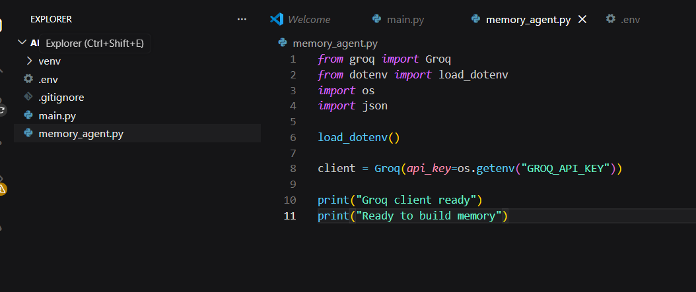

Run the file:

```cmd
python memory_agent.py
```

### Expected Output

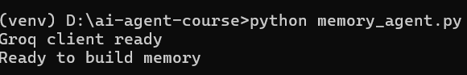

## Step 2 — Give Your Agent a Personality

Open `memory_agent.py` and add:

```python
system_prompt = """
You are a helpful AI assistant named Rohi.
You are friendly, concise, and always answer clearly.
You remember everything the user tells you in this conversation.
When you do not know something, you say so honestly.
"""

print("System prompt set")
print("Agent name: Rohi")
print("Personality: Friendly and concise")
```

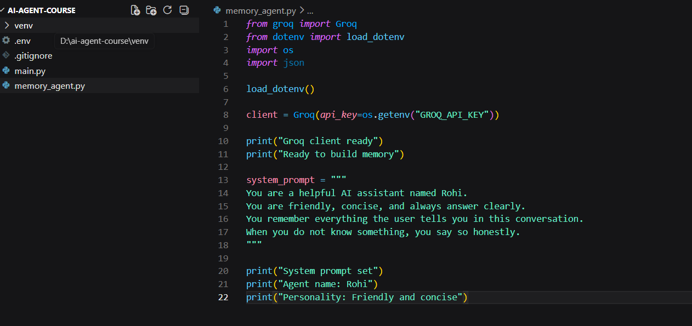

Run the file:

```cmd
python memory_agent.py
```

### Expected Output

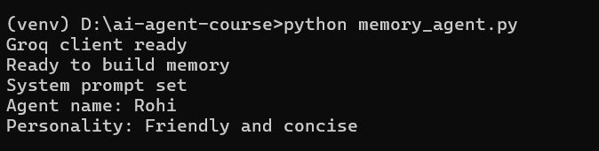


```python

```

## Step 3 — Understand Memory

Memory in an AI agent is just a **Python list** that stores every message.

Each message is a dictionary with two keys:

- `role` → who sent the message
- `content` → what they said

This conversation history is what allows an AI agent to remember previous messages and respond with context.

Open `memory_agent.py` and add:

```python
# This is what memory looks like
example_memory = [
    {"role": "user", "content": "My name is Rohith"},
    {"role": "assistant", "content": "Nice to meet you Rohith! How can I help you today?"},
    {"role": "user", "content": "What is my name?"},
    {"role": "assistant", "content": "Your name is Rohith, you just told me!"}
]

print("Memory contains", len(example_memory), "messages")
print()

for msg in example_memory:
    print(f"{msg['role'].upper()}: {msg['content']}")
```

Run the file:

```cmd
python memory_agent.py
```

### Expected Output

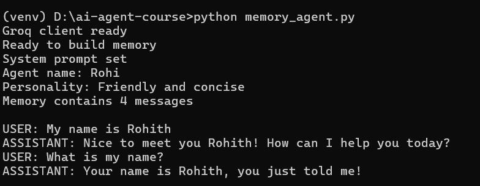

## Step 4 — Create Real Memory and Chat Function

Now it's time to build real memory.

The `memory` list will store every message in the conversation.

Every time you call `chat()`:

1. The user's message is added to memory
2. The entire conversation history is sent to Groq
3. The AI's response is added back to memory

This is the foundation of a conversational AI agent.

Open `memory_agent.py` and add:

```python
# Start with empty memory
memory = []

def chat(user_input):
    # Add user message to memory
    memory.append({"role": "user", "content": user_input})

    # Send full memory to Groq every time
    response = client.chat.completions.create(
        model="llama-3.1-8b-instant",
        messages=[
            {"role": "system", "content": system_prompt},
            *memory
        ]
    )

    reply = response.choices[0].message.content

    # Add agent reply to memory
    memory.append({"role": "assistant", "content": reply})

    return reply

print("Memory initialized")
print("Chat function ready")
```

Run the file:

```cmd
python memory_agent.py
```

### Expected Output

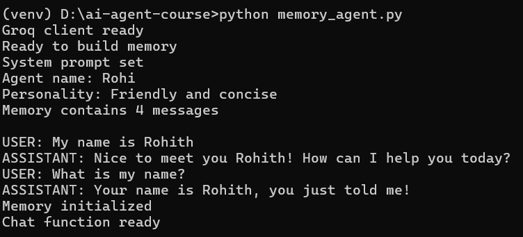

## Step 5 — Test Your Agent's Memory

Now let's prove that memory is working.

In the first message, you'll tell the agent your name and what you're building.

In the second message, you'll ask the agent to recall that information.

If memory is working correctly, the agent should remember both details without you repeating them.

Open `memory_agent.py` and add:

```python
# Message 1
question1 = "Hi! My name is Rohith and I am building an AI agent."
print("You:", question1)

reply1 = chat(question1)
print("Rohi:", reply1)

print()

# Message 2
question2 = "What is my name and what am I building?"
print("You:", question2)

reply2 = chat(question2)
print("Rohi:", reply2)

print()
print("Memory now has", len(memory), "messages stored")
```

Run the file:

```cmd
python memory_agent.py
```

### Expected Output

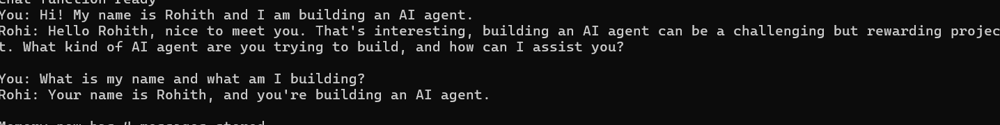

Notice what happened:

- The user's messages were stored in memory
- The AI responses were stored in memory
- The full conversation history was sent with each request
- The agent remembered information from earlier messages

## Step 6 — Inspect the Memory

Let's look inside the memory list and see exactly what the agent has stored.

Remember: memory is just a Python list containing every user message and every AI response.

By printing the memory, you can see the complete conversation history that gets sent to Groq on each request.

Open `memory_agent.py` and add:

```python
print("=== MEMORY CONTENTS ===")
print()

for i, msg in enumerate(memory):
    print(f"Message {i+1} — {msg['role'].upper()}")
    print(msg['content'])
    print("-" * 40)
```

Run the file:

```cmd
python memory_agent.py
```

### Expected Output

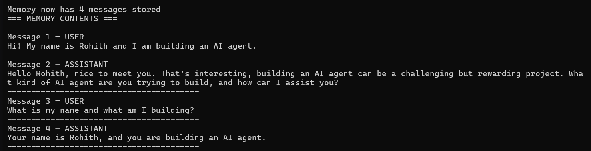

Notice that both user messages and AI responses are stored.

This conversation history is what gives your agent memory.

## Step 7 — Save Memory to a File

Right now, memory is lost when you close the program.

To keep conversations between sessions, you can save the memory list to a JSON file.

This file can be loaded later so your agent remembers past conversations.

Open `memory_agent.py` and add:

```python
def save_memory():
    with open("memory.json", "w") as f:
        json.dump(memory, f, indent=2)

    print(f"Memory saved to memory.json ({len(memory)} messages)")

save_memory()
```

Run the file:

```cmd
python memory_agent.py
```

### Expected Output

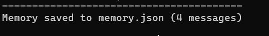


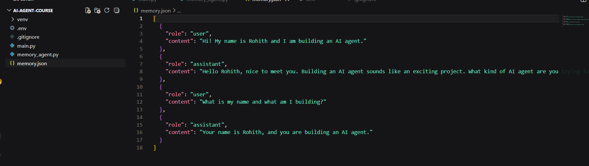


A new file named `memory.json` will be created in your project folder containing the conversation history.

## Step 8 — Load Memory from File

Saving memory is useful, but the real power comes from loading it back when the program starts.

This allows your agent to continue previous conversations instead of starting from scratch every time.

Open `memory_agent.py` and add:

```python
def load_memory():
    global memory

    try:
        with open("memory.json", "r") as f:
            memory = json.load(f)

        print(f"Memory loaded — {len(memory)} messages restored")

    except FileNotFoundError:
        print("No saved memory found. Starting fresh.")

load_memory()
```

Run the file:

```cmd
python memory_agent.py
```

### Expected Output


Now your agent can restore previous conversations from disk instead of losing everything when the program closes.

## Step 9 — Build the Full Chat Loop

Now it's time to turn your code into a real AI agent.

This chat loop allows you to have an ongoing conversation with Rohi.

Each message is stored in memory, sent to Groq, and added back to the conversation history.

Type `quit` at any time to save memory and exit the program.

Open `memory_agent.py` and add:

```python
# Reset memory for a fresh conversation
memory = []

print("Rohi is ready. Type 'quit' to exit and save.\n")

while True:
    user_input = input("You: ")

    if user_input.lower() == "quit":
        save_memory()
        print("Rohi: Goodbye! See you next time.")
        break

    if not user_input.strip():
        continue

    reply = chat(user_input)
    print(f"Rohi: {reply}\n")
```

Run the file:

```cmd
python memory_agent.py
```

### Example Conversation
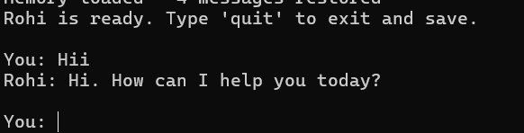

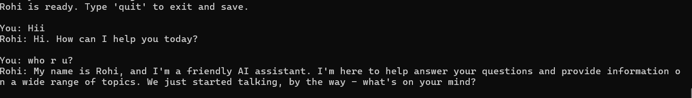


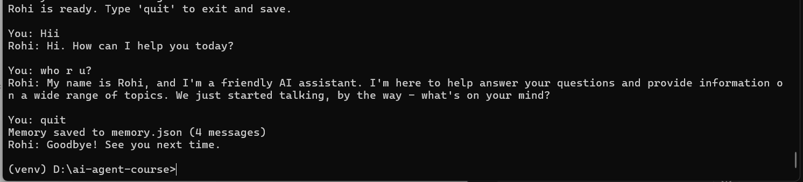

Congratulations! 🎉

You now have a real AI agent with:

- A personality
- Conversation memory
- Persistent storage using JSON
- An interactive chat interface

This is the foundation for everything you'll build next.

---
## ✅ Day 3 Complete

| Task | Status |
|---|---|
| System prompt and personality set | ✅ |
| Memory list created | ✅ |
| Chat function with memory built | ✅ |
| Memory test passed | ✅ |
| Memory saved to JSON file | ✅ |
| Memory loaded from JSON file | ✅ |
| Full interactive chat loop working | ✅ |

---

### What is Coming Tomorrow

On **Day 4** you will:
- Build a web search tool using DuckDuckGo
- Build a calculator tool
- Build a file reader tool
- Connect all tools to your agent so it can actually do things

See you there! 🚀
