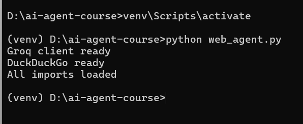
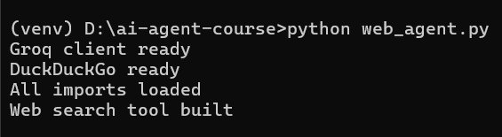
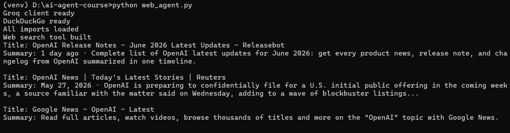
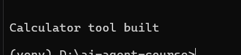
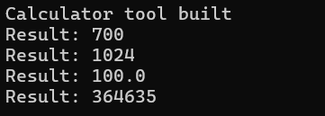
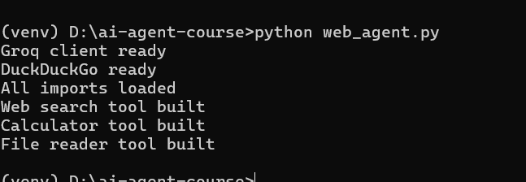
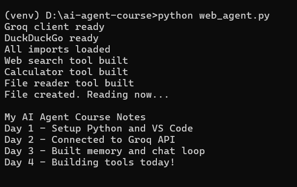
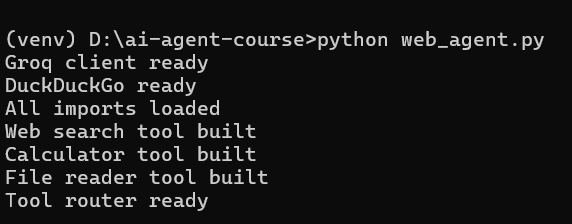
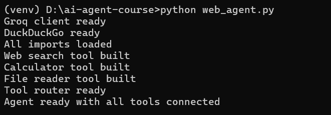
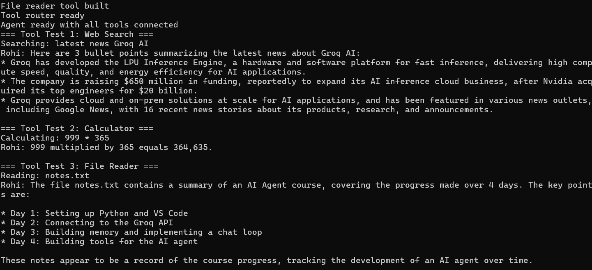

# 🤖 Day 4 — Give Your Agent Tools
### AI Agent Course — RohithBuilds

Today you will build real tools for your agent.  
A tool is just a Python function your agent can call when it needs to do something.  
By the end your agent will search the web, solve math, and read files.

---

## Step 1 — Setup

Today we'll give our AI agent access to the internet.

Before we can do that, we need to load our API key, connect to Groq, and import the search library that will allow the agent to find information online.

Create a file named `web_agent.py` and add:

```python
from groq import Groq
from dotenv import load_dotenv
from ddgs import DDGS
import os
import json

load_dotenv()

client = Groq(api_key=os.getenv("GROQ_API_KEY"))

print("Groq client ready")
print("DuckDuckGo ready")
print("All imports loaded")
```

Run the file:

```cmd
python web_agent.py
```

### Expected Output



## Step 2 — Build the Web Search Tool

Now we'll create our first tool.

A tool is simply a Python function that gives the AI a new capability.

This tool searches DuckDuckGo and returns the top 3 results.

The best part? No API key is required.

Open `web_agent.py` and add:

```python
def search_web(query):
    try:
        with DDGS() as ddgs:
            results = list(ddgs.text(query, max_results=3))

        if not results:
            return "No results found."

        output = ""

        for r in results:
            output += f"Title: {r['title']}\n"
            output += f"Summary: {r['body']}\n\n"

        return output

    except Exception as e:
        return f"Search error: {str(e)}"

print("Web search tool built")
```

Run the file:

```cmd
python web_agent.py
```

### Expected Output



You now have your first AI tool.

The agent can use this function to search the web and retrieve information in real time.

## Step 3 — Test Web Search

Before giving this tool to the AI, let's test it ourselves.

Web search is useful because information on the internet changes every day.

For example:

- A new AI model may be released today
- A company may announce a new product this morning
- A library may release a new version this week
- An AI model without web access may not know these updates

Let's test our search tool with a real-world query.

Open `web_agent.py` and add:

```python
results = search_web("latest OpenAI announcements")
print(results)
```

Run the file:

```cmd
python web_agent.py
```

### Expected Output



The exact results will vary because they come from live web data.

This is why tools matter:

- The AI provides reasoning and explanations
- The search tool provides fresh information
- Together they can answer questions about things that happened recently

## Step 4 — Build the Calculator Tool

Not every question needs AI.

For math problems, it's usually better to let Python calculate the answer directly.

We'll create a simple calculator tool that can solve mathematical expressions and return the result instantly.

Open `web_agent.py` and add:

```python
def calculate(expression):
    try:
        result = eval(expression)
        return f"Result: {result}"

    except Exception as e:
        return f"Calculation error: {str(e)}"

print("Calculator tool built")
```

Run the file:

```cmd
python web_agent.py
```

### Expected Output



Your agent now has a second tool: a calculator.

## Step 5 — Test the Calculator Tool

Before giving the calculator to the AI, let's test it ourselves.

We'll try a few different calculations and verify that the tool returns the correct answers.

Open `web_agent.py` and add:

```python
print(calculate("125 * 4 + 200"))
print(calculate("2 ** 10"))
print(calculate("(500 - 200) / 3"))
print(calculate("999 * 365"))
```

Run the file:

```cmd
python web_agent.py
```

### Expected Output



Notice that the calculator can handle:

- Addition
- Subtraction
- Multiplication
- Division
- Parentheses
- Powers

This gives your agent the ability to solve math problems accurately instead of relying on the AI model to calculate them.

## Step 6 — Build the File Reader Tool

AI agents often need to work with files.

A file reader tool allows the agent to open text files, read their contents, and use that information when answering questions.

We'll create a simple tool that reads any text file from the project folder.

Open `web_agent.py` and add:

```python
def read_file(filename):
    try:
        with open(filename, "r") as f:
            content = f.read()

        return content

    except FileNotFoundError:
        return f"File '{filename}' not found."

    except Exception as e:
        return f"File read error: {str(e)}"

print("File reader tool built")
```

Run the file:

```cmd
python web_agent.py
```

### Expected Output



Your agent now has a third tool: a file reader.

## Step 7 — Test the File Reader Tool

Before giving this tool to the AI, let's test it ourselves.

We'll create a text file, save some notes, and then use our file reader to load and display the contents.

Open `web_agent.py` and add:

```python
# Create a test file
with open("notes.txt", "w") as f:
    f.write("My AI Agent Course Notes\n")
    f.write("Day 1 - Setup Python and VS Code\n")
    f.write("Day 2 - Connected to Groq API\n")
    f.write("Day 3 - Built memory and chat loop\n")
    f.write("Day 4 - Building tools today!\n")

print("File created. Reading now...\n")

print(read_file("notes.txt"))
```

Run the file:

```cmd
python web_agent.py
```

### Expected Output



The agent can now read information stored in files and use it when needed.

## Step 8 — Build the Tool Router

Right now, we have three separate tools:

- `search_web()`
- `calculate()`
- `read_file()`

But our agent doesn't know how to use them yet.

The job of a tool router is to look at the agent's response and decide which tool should run.

Think of it as a traffic controller that sends requests to the correct tool.

Open `web_agent.py` and add:

```python
def run_tool(agent_reply):
    if "search_web(" in agent_reply:
        try:
            query = agent_reply.split('search_web("')[1].split('"')[0]
            print(f"Searching: {query}")
            return search_web(query)

        except:
            return None

    elif "calculate(" in agent_reply:
        try:
            expression = agent_reply.split('calculate("')[1].split('"')[0]
            print(f"Calculating: {expression}")
            return calculate(expression)

        except:
            return None

    elif "read_file(" in agent_reply:
        try:
            filename = agent_reply.split('read_file("')[1].split('"')[0]
            print(f"Reading: {filename}")
            return read_file(filename)

        except:
            return None

    return None

print("Tool router ready")
```

Run the file:

```cmd
python web_agent.py
```

### Expected Output




The router doesn't run any tools by itself.

Its job is to detect tool calls and send them to the correct function.

In the next step, we'll connect this router to the AI so the agent can choose and use tools automatically.

## Step 9 — Connect Everything to the Agent

Now it's time to bring everything together.

So far we've built:

- A web search tool
- A calculator tool
- A file reader tool
- A tool router

Now we'll connect them to our AI agent.

The system prompt teaches the AI what tools are available and how to use them.

When the AI needs a tool, it will return a tool call instead of a normal response.

The tool router will then detect the tool call and execute the correct function.

Open `web_agent.py` and add:

```python
memory = []

system_prompt = """
You are a helpful AI assistant named Rohi.

You have access to these tools:

- search_web("query") — search the internet
- calculate("expression") — solve math
- read_file("filename") — read a file

When a tool is needed, respond ONLY with the tool call.

Example:

search_web("latest AI news")

calculate("125 * 4")

read_file("notes.txt")

For normal questions, answer directly.
"""

def chat(user_input):
    memory.append({"role": "user", "content": user_input})

    response = client.chat.completions.create(
        model="llama-3.3-70b-versatile",
        messages=[
            {"role": "system", "content": system_prompt},
            *memory
        ]
    )

    reply = response.choices[0].message.content

    memory.append({"role": "assistant", "content": reply})

    return reply

print("Agent ready with all tools connected")
```

Run the file:

```cmd
python web_agent.py
```

### Expected Output



At this point, the AI knows:

- What tools exist
- When to use them
- How to call them

In the next step, we'll let the agent use those tools automatically during a conversation.

## Step 10 — Test All 3 Tools Live

Now it's time to see the complete agent in action.

We'll test all three tools:

1. Web Search
2. Calculator
3. File Reader

The flow works like this:

- The user asks a question
- The AI decides which tool to use
- The tool router executes the tool
- The result is sent back to the AI
- The AI creates a final answer for the user

Open `web_agent.py` and add:

```python
# ==========================================
# Tool Test 1 — Web Search
# ==========================================

print("=== Tool Test 1: Web Search ===")

reply = chat("Search for the latest news about Groq AI")
tool_result = run_tool(reply)

if tool_result:
    final = chat(f"Tool result: {tool_result}. Summarize in 3 bullet points.")
    print("Rohi:", final)
else:
    print("Rohi:", reply)


# ==========================================
# Tool Test 2 — Calculator
# ==========================================

print("\n=== Tool Test 2: Calculator ===")

reply = chat("Calculate 999 multiplied by 365")
tool_result = run_tool(reply)

if tool_result:
    final = chat(f"Tool result: {tool_result}. Give the user a clear answer.")
    print("Rohi:", final)
else:
    print("Rohi:", reply)


# ==========================================
# Tool Test 3 — File Reader
# ==========================================

print("\n=== Tool Test 3: File Reader ===")

reply = chat("Read the file notes.txt and summarize it")
tool_result = run_tool(reply)

if tool_result:
    final = chat(f"Tool result: {tool_result}. Summarize for the user.")
    print("Rohi:", final)
else:
    print("Rohi:", reply)
```

Run the file:

```cmd
python web_agent.py
```

### Example Output



Congratulations! 🎉

Your AI agent can now:

- Search the web
- Perform calculations
- Read files
- Decide which tool to use
- Combine tool results with AI reasoning

This is your first real tool-using AI agent.

---
## ✅ Day 4 Complete

| Task | Status |
|---|---|
| Web search tool built and tested | ✅ |
| Calculator tool built and tested | ✅ |
| File reader tool built and tested | ✅ |
| Tool router connected to agent | ✅ |
| All 3 tools working with real results | ✅ |

---

### What is Coming Tomorrow

On **Day 5** you will:
- Build the full Research Agent
- Agent searches any topic automatically
- Agent writes a structured report from results
- Report saved to a file with one command

See you there! 🚀
