# 🤖 Day 5 — Build the Research Agent
### AI Agent Course — RohithBuilds

Today you put everything together.  
Your agent will take any topic, search the web, read the results, and write a full research report saved to a file — all automatically.

---

## Step 1 — Setup

Today we'll build a Research Agent.

Unlike the Day 4 agent that simply used tools, this agent will gather information from multiple sources and create more detailed answers.

Create a new file named `research_agent.py` and add:

```python
from groq import Groq
from dotenv import load_dotenv
from ddgs import DDGS
import os

load_dotenv()

client = Groq(api_key=os.getenv("GROQ_API_KEY"))

print("Groq client ready")
print("DuckDuckGo ready")
print("Ready to build Research Agent")
```

Run the file:

```cmd
python research_agent.py
```

### Expected Output

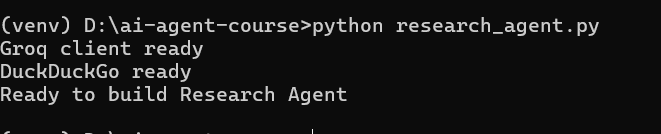

## Step 2 — Build the Search Tool

Research agents need more information than regular chat agents.

Instead of retrieving just a few search results, we'll collect 5 results to give the AI a stronger knowledge base.

Open `research_agent.py` and add:

```python
def search_web(query):
    try:
        with DDGS() as ddgs:
            results = list(ddgs.text(query, max_results=5))

        if not results:
            return "No results found."

        output = ""

        for i, r in enumerate(results):
            output += f"Result {i+1}:\n"
            output += f"Title: {r['title']}\n"
            output += f"Summary: {r['body']}\n\n"

        return output

    except Exception as e:
        return f"Search error: {str(e)}"

print("Search tool ready")
```

Run the file:

```cmd
python research_agent.py
```

### Expected Output

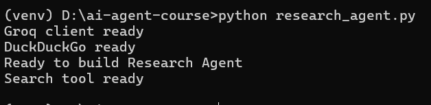


This version returns 5 search results, giving the agent more information to analyze before creating a final answer.

## Step 3 — Test the Search Tool

Before building the research agent, let's verify that our search tool is working correctly.

We'll search for information about Python and inspect the results returned from DuckDuckGo.

Open `research_agent.py` and add:

```python
test_results = search_web("Python programming language")

print(test_results)
```

Run the file:

```cmd
python research_agent.py
```

### Expected Output

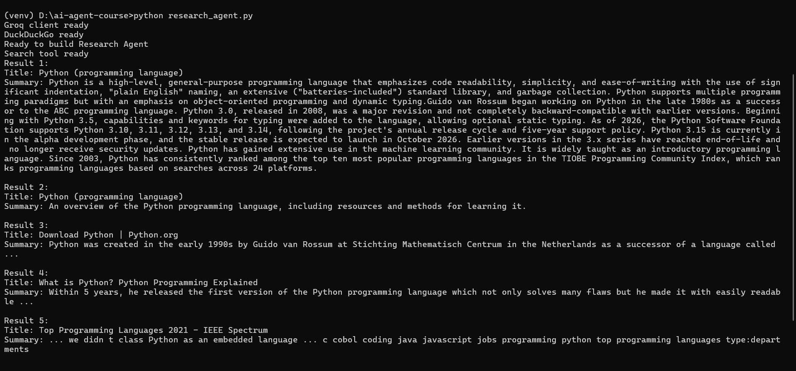

The exact results will vary because they come from live web searches.

Our research agent can now gather information from multiple sources before generating an answer.

## Step 4 — Build the Report Writer

Searching for information is only the first step.

A research agent should be able to read multiple sources, analyze them, and create a structured report.

We'll build a report writer that sends the search results to Groq and asks it to generate a well-organized research report.

Open `research_agent.py` and add:

```python
def write_report(topic, search_results):
    prompt = f"""
You are a research assistant.

Based on the following search results about "{topic}", write a detailed research report.

Search Results:
{search_results}

Write the report with exactly these sections:

1. Overview
2. Key Facts
3. Latest Developments
4. Conclusion

Be clear, detailed, and beginner friendly.
"""

    response = client.chat.completions.create(
        model="llama-3.3-70b-versatile",
        messages=[
            {"role": "user", "content": prompt}
        ]
    )

    return response.choices[0].message.content

print("Report writer ready")
```

Run the file:

```cmd
python research_agent.py
```

### Expected Output

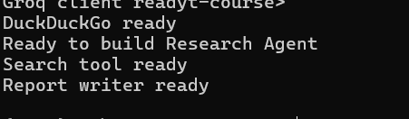

The research agent can now:

1. Gather information from the web
2. Send that information to Groq
3. Generate a structured research report from multiple sources

## Step 5 — Build the Save Function

Now that our agent can generate research reports, we need a way to store them.

This function saves the final report into a `.txt` file so you can access it later, share it, or reuse it.

The file name is automatically created from the topic.

Open `research_agent.py` and add:

```python
def save_report(topic, report):
    filename = topic.lower().replace(" ", "-") + "-report.txt"

    with open(filename, "w") as f:
        f.write(f"Research Report: {topic}\n")
        f.write("=" * 50 + "\n\n")
        f.write(report)

    print(f"Report saved to {filename}")
    return filename

print("Save function ready")
```

Run the file:

```cmd
python research_agent.py
```

### Expected Output

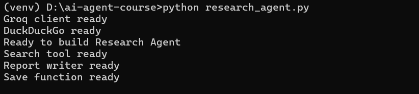

Now your research agent can:

- Generate a report
- Format it properly
- Save it as a readable file on your system

## Step 6 — Build the Main Research Agent

Now we combine everything into one complete system.

This function will:

1. Search the web for the topic  
2. Send results to the AI to generate a report  
3. Save the report to a file  
4. Show a preview of the output  

This is your full **end-to-end AI research pipeline**.

Open `research_agent.py` and add:

```python
def research_agent(topic):
    print(f"\nSearching the web for: {topic}")

    search_results = search_web(topic)
    print("Search complete")

    print("Writing report...")
    report = write_report(topic, search_results)
    print("Report written")

    print("Saving to file...")
    filename = save_report(topic, report)

    print("\n" + "=" * 50)
    print("REPORT PREVIEW (first 600 chars)")
    print("=" * 50)

    print(report[:600])
    print("\n...")

    print(f"\nFull report saved to: {filename}")


print("Research agent ready")
```

Run the file:

```cmd
python research_agent.py
```

### Expected Output

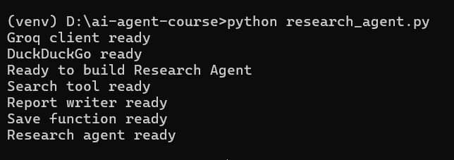

At this point, your agent is fully built and ready to run real research tasks.

In the next step, we will test it with a real topic and generate a full AI-written report.

## Step 6 — Build the Main Research Agent

Now we combine everything into one complete system.

This function will:

1. Search the web for the topic  
2. Send results to the AI to generate a report  
3. Save the report to a file  
4. Show a preview of the output  

This is your full **end-to-end AI research pipeline**.

Open `research_agent.py` and add:

```python
def research_agent(topic):
    print(f"\nSearching the web for: {topic}")

    search_results = search_web(topic)
    print("Search complete")

    print("Writing report...")
    report = write_report(topic, search_results)
    print("Report written")

    print("Saving to file...")
    filename = save_report(topic, report)

    print("\n" + "=" * 50)
    print("REPORT PREVIEW (first 600 chars)")
    print("=" * 50)

    print(report[:600])
    print("\n...")

    print(f"\nFull report saved to: {filename}")


print("Research agent ready")
```

Run the file:

```cmd
python research_agent.py
```

### Expected Output

```cmd
Research agent ready
```

At this point, your agent is fully built and ready to run real research tasks.

In the next step, we will test it with a real topic and generate a full AI-written report.

## Step 7 — Run the Research Agent

Now it's time to test everything together.

This is the full pipeline:

- It searches the web
- It collects multiple results
- It sends them to Groq
- It generates a structured report
- It saves the report as a file
- It shows a preview of the final output

Open `research_agent.py` and add:

```python
research_agent("Artificial Intelligence in 2025")
```

Run the file:

```cmd
python research_agent.py
```

### Expected Output


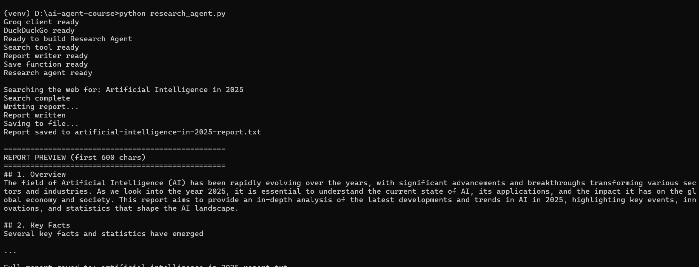

Now your AI system can:

- Research any topic
- Understand multiple sources
- Generate structured reports
- Save results automatically

This is your first **real AI research agent**.

---
## Step 8 — Open the Saved Report

In VS Code open the file that was just saved.  
You will see the full structured report with all 4 sections.

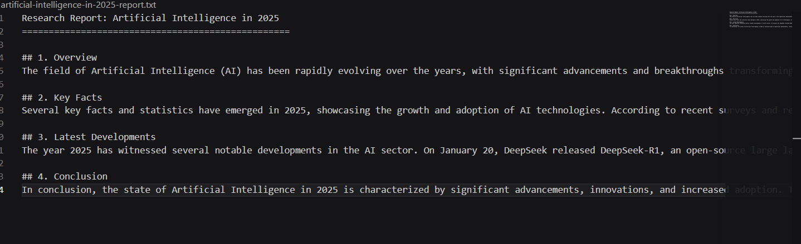

## Step 10 — Make It Interactive

Now we turn your research agent into something you can actually use like a real tool.

Instead of hardcoding a topic, you will type your own topic and the agent will generate a full report instantly.

Open `research_agent.py` and add:

```python
topic = input("Enter a topic for research: ")

research_agent(topic)
```

Run the file:

```cmd
python research_agent.py
```

### Expected Output

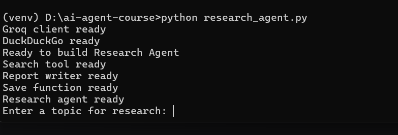

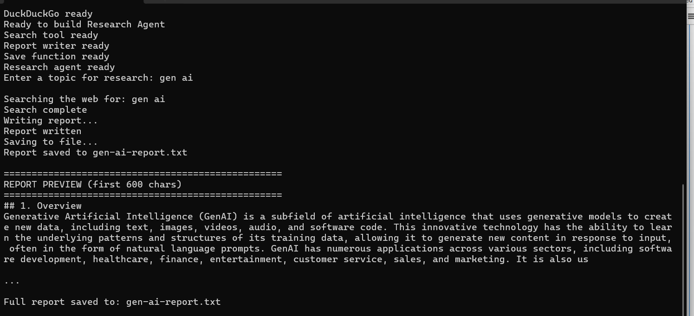

Now your AI research agent is fully interactive.

You can type any topic and get:

- Live web research
- AI-written structured report
- Saved file output
- Instant preview

This completes your **AI Research Agent project**.

## Step 11 — Check Your Project Folder

Now let’s verify what your agent has created.

Every time you run the research agent, it generates a `.txt` report file.

This step helps you see all the reports stored in your project folder.

Open `research_agent.py` and add:

```python
import os

report_files = [f for f in os.listdir(".") if f.endswith("-report.txt")]

print(f"You have generated {len(report_files)} research reports today:\n")

for f in report_files:
    size = os.path.getsize(f)
    print(f"Report file: {f} ({size} bytes)")
```

Run the file:

```cmd
python research_agent.py
```

### Expected Output

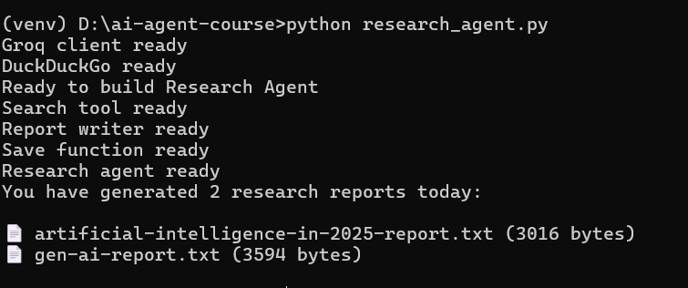

Now you can clearly see:

- All generated research reports
- File sizes
- Stored outputs from your AI agent

This confirms your system is not just generating responses — it is building real saved outputs like a production tool.

---
## ✅ Day 5 Complete

| Task | Status |
|---|---|
| Search tool fetching 5 results | ✅ |
| Report writer generating structured reports | ✅ |
| Reports auto saved to named .txt files | ✅ |
| Full research agent working end to end | ✅ |
| Multiple topics researched | ✅ |
| Interactive topic input working | ✅ |

---

### What is Coming Tomorrow

On **Day 6** you will:
- Wrap your agent in a Flask web app
- Build a proper chat UI in the browser
- Push to GitHub
- Deploy live on Render so anyone can use it

See you there! 🚀
