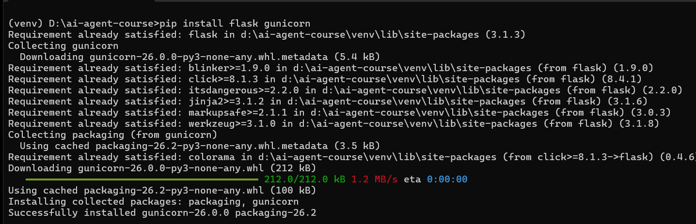
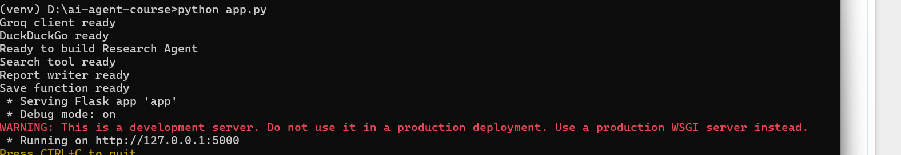
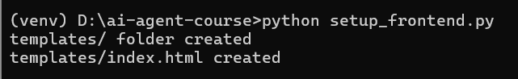
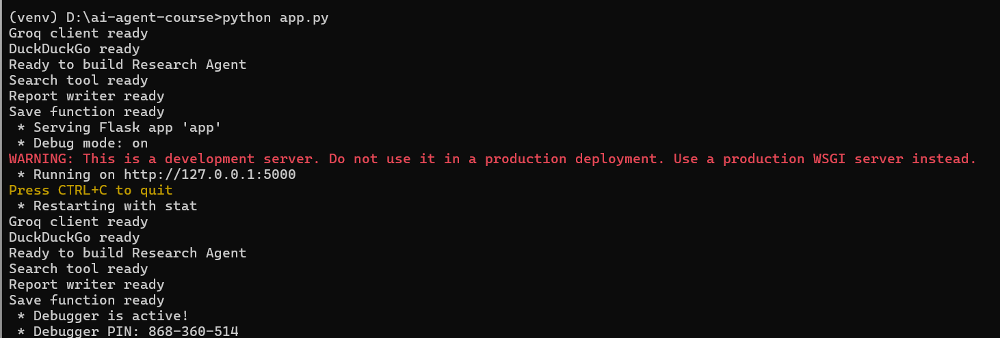
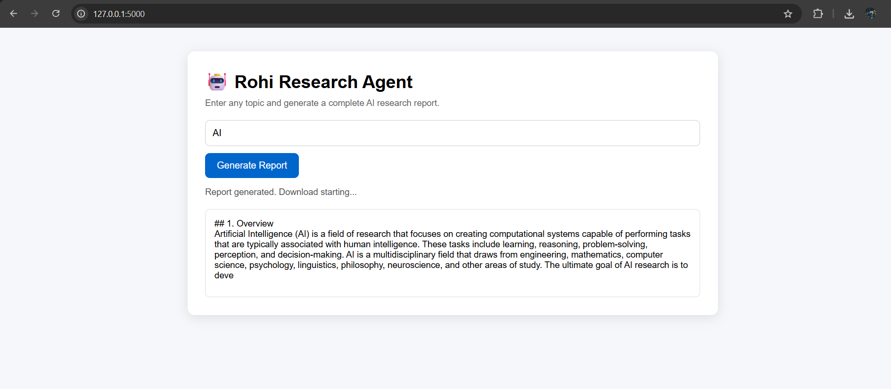
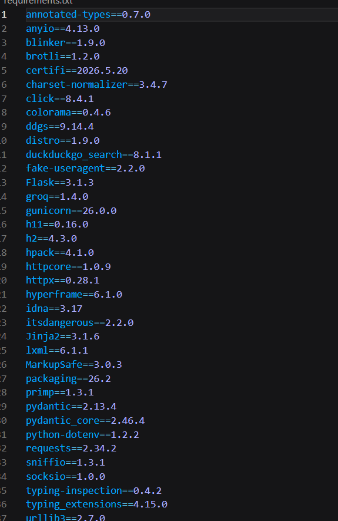
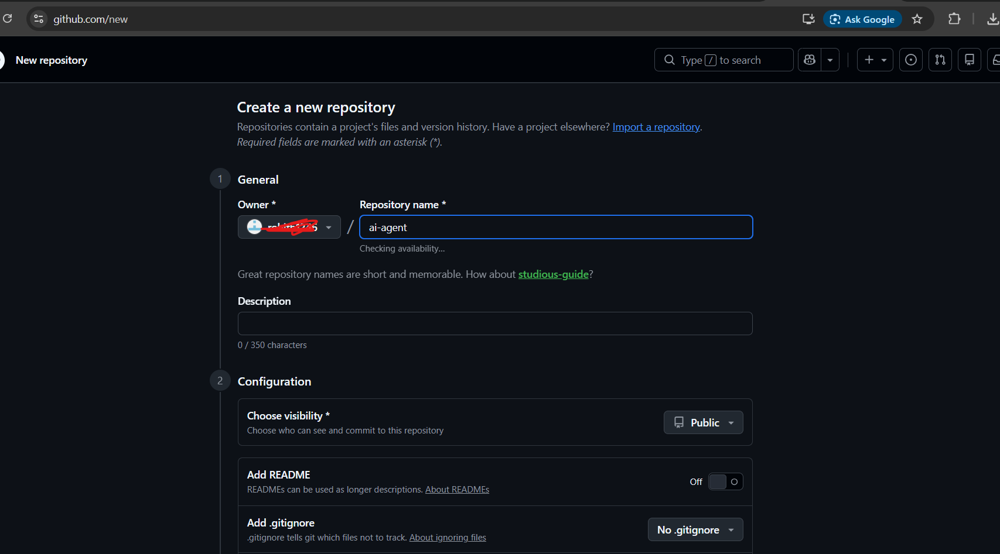
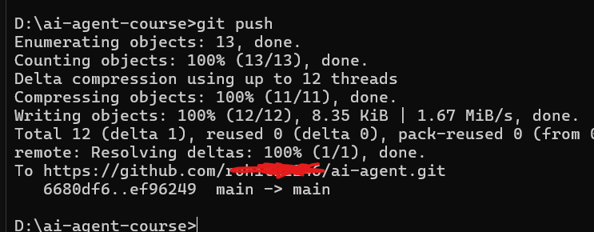
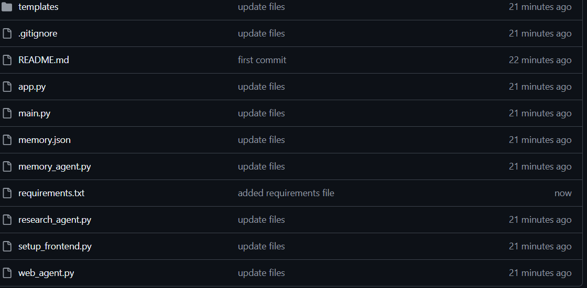

# 🤖 Day 6 — Build a Web UI and Deploy Live
### AI Agent Course — RohithBuilds

Today you will wrap your agent in a Flask web app 


## Step 1 — Install Flask and Gunicorn

Today we are turning your AI agent into a real web application.

To do this, we need two libraries:

- **Flask** → builds the web server
- **Gunicorn** → used later for production deployment

Open your terminal and run:

```cmd
pip install flask gunicorn
```

### Expected Output



Now your system is ready to convert your AI agent into a web app.

## Step 2 — Create `app.py`

Now we are connecting our Flask application to the Research Agent built in Day 5.

Instead of rewriting the search and report logic, we'll import and reuse the functions from `research_agent.py`.

Create a file named:

```text
app.py
```

Add:

```python
from flask import Flask, request, jsonify, render_template, send_file
from dotenv import load_dotenv
import os

# Import functions from Day 5
from research_agent import search_web, write_report, save_report

load_dotenv()

app = Flask(__name__)


@app.route("/")
def home():
    return render_template("index.html")


@app.route("/research", methods=["POST"])
def research_route():

    data = request.get_json()
    topic = data.get("topic", "").strip()

    if not topic:
        return jsonify({
            "success": False,
            "error": "Please enter a topic."
        })

    print(f"Researching: {topic}")

    search_results = search_web(topic)

    report = write_report(
        topic,
        search_results
    )

    filename = save_report(
        topic,
        report
    )

    return jsonify({
        "success": True,
        "filename": filename,
        "preview": report[:500]
    })


@app.route("/download/<filename>")
def download_report(filename):
    return send_file(
        filename,
        as_attachment=True
    )


if __name__ == "__main__":
    app.run(debug=True)
```

Run the file:

```cmd
python app.py
```

### Expected Output


What this app does:

- Receives a research topic
- Searches the web
- Generates a report using Groq
- Saves the report automatically
- Provides a download link for the generated file

In the next step, we'll build the web page that lets users enter a topic and download the report from their browser.

## Step 3 — Create the Templates Folder and `index.html`

Instead of manually creating folders and files, we'll generate everything automatically using a setup script.

Create a new file:

```text
setup_frontend.py
```

Add:

```python
import os

os.makedirs("templates", exist_ok=True)

html_code = '''
<!DOCTYPE html>
<html>
<head>
    <title>Rohi Research Agent</title>

    <style>
        * {
            box-sizing: border-box;
            margin: 0;
            padding: 0;
        }

        body {
            font-family: Arial, sans-serif;
            background: #f5f7fb;
            display: flex;
            justify-content: center;
            padding: 40px;
        }

        .container {
            background: white;
            width: 100%;
            max-width: 900px;
            padding: 30px;
            border-radius: 12px;
            box-shadow: 0 4px 20px rgba(0,0,0,0.1);
        }

        h1 {
            margin-bottom: 10px;
        }

        p {
            color: #666;
            margin-bottom: 20px;
        }

        input {
            width: 100%;
            padding: 12px;
            margin-bottom: 12px;
            border: 1px solid #ccc;
            border-radius: 8px;
            font-size: 16px;
        }

        button {
            padding: 12px 20px;
            border: none;
            border-radius: 8px;
            cursor: pointer;
            font-size: 16px;
            background: #0066cc;
            color: white;
        }

        #preview {
            margin-top: 20px;
            padding: 15px;
            border: 1px solid #ddd;
            border-radius: 8px;
            white-space: pre-wrap;
            min-height: 150px;
        }

        .status {
            margin-top: 15px;
            color: #555;
        }
    </style>
</head>

<body>

<div class="container">

    <h1>🤖 Rohi Research Agent</h1>

    <p>
        Enter any topic and generate a complete AI research report.
    </p>

    <input
        id="topic"
        type="text"
        placeholder="Example: Artificial Intelligence in Healthcare"
    >

    <button onclick="generateReport()">
        Generate Report
    </button>

    <div class="status" id="status"></div>

    <div id="preview">
        Report preview will appear here...
    </div>

</div>

<script>

async function generateReport() {

    const topic =
        document.getElementById("topic").value.trim();

    if (!topic) {
        alert("Please enter a topic.");
        return;
    }

    document.getElementById("status").innerText =
        "Researching...";

    const response = await fetch("/research", {
        method: "POST",
        headers: {
            "Content-Type": "application/json"
        },
        body: JSON.stringify({
            topic: topic
        })
    });

    const data = await response.json();

    if (!data.success) {
        document.getElementById("status").innerText =
            data.error;
        return;
    }

    document.getElementById("preview").innerText =
        data.preview;

    document.getElementById("status").innerText =
        "Report generated. Download starting...";

    window.location.href =
        "/download/" + data.filename;
}

</script>

</body>
</html>
'''

with open("templates/index.html", "w", encoding="utf-8") as f:
    f.write(html_code)

print("templates/ folder created")
print("templates/index.html created")
```

Run the file:

```cmd
python setup_frontend.py
```

### Expected Output



Project structure:

```text
ai-agent-course/
│
├── app.py
├── research_agent.py
├── setup_frontend.py
│
└── templates/
    └── index.html
```

Now start the web app:

```cmd
python app.py
```

Then open:

```text
http://127.0.0.1:5000
```

## Step 4 — Run Flask Locally

Make sure your virtual environment is activated first.

Open **Command Prompt** and navigate to your project folder:

```cmd
cd D:\ai-agent-course
```

Activate the virtual environment:

```cmd
venv\Scripts\activate
```

You should see:

```cmd
(venv) D:\ai-agent-course>
```

Now start the Flask application:

```cmd
python app.py
```

### Expected Output





Open your browser and visit:

```text
http://127.0.0.1:5000
```



You should see your **Rohi Research Agent** interface.

To stop the server later:

```cmd
Ctrl + C
```

## Step 5 — Create `requirements.txt`

When deploying to Render, the platform needs to know which Python libraries to install.

We'll generate a `requirements.txt` file directly from the packages installed in our virtual environment.

Make sure your virtual environment is activated:

```cmd
venv\Scripts\activate
```

Then run:

```cmd
pip freeze > requirements.txt
```

Open the file to verify it was created:

```cmd
type requirements.txt
```

### Expected Output



Your project now contains:

```text
requirements.txt
```

Render will use this file automatically during deployment.

## Step 6 — Create `.gitignore`

Some files should never be uploaded to GitHub.

For example:

- API keys
- Virtual environments
- Cache files
- Generated reports

Create a file named:

```text
.gitignore
```

Add:

```text
.env
venv/
__pycache__/
*.pyc
*.txt
memory.json
```

Save the file.

### Why This Matters

This protects:

- Your Groq API key
- Virtual environment files
- Temporary Python files
- Generated report files

Your `.env` file will now stay private when pushing to GitHub.

## Step 7 — Push Your Project to GitHub

Now it's time to upload your project to GitHub.

First, create a new repository:

1. Go to GitHub
2. Click **New Repository**
3. Repository name:

```text
ai-agent-course
```


4. Click **Create Repository**

Open Command Prompt in your project folder:

```cmd
cd D:\ai-agent-course
```

Initialize Git:

```cmd
git init
```

Add all project files:

```cmd
git add .
```

Create your first commit:

```cmd
git commit -m "AI agent project - Day 6"
```

Rename the branch:

```cmd
git branch -M main
```

Connect your GitHub repository:

Replace `yourusername` with your actual GitHub username.

```cmd
git remote add origin https://github.com/yourusername/ai-agent-course.git
```

Push your code:

```cmd
git push -u origin main
```

### Expected Output



### Verify Upload

Refresh your GitHub repository page.

You should see files similar to:



Your project is now stored on GitHub and ready for deployment.

## Congratulations 🎉

You have successfully built a complete AI Research Web Application.

Your app can:

- Accept a research topic
- Search the web
- Generate an AI-written report
- Save the report automatically
- Download the report to the user's device
- Run entirely in the browser

Project structure:

```text
app.py
research_agent.py
setup_frontend.py
requirements.txt
templates/
```

At this point your application works perfectly on your own computer.

But there is one limitation:

```text
Only you can access it.
```

If someone else wants to use your AI Research Agent, they would need your code and your computer.

In Day 7, we'll solve that problem.

We'll deploy your application to the internet so anyone in the world can open a link and use your AI Research Agent.


---
## ✅ Day 6 Complete

| Task | Status |
|---|---|
| Flask application created | ✅ |
| Research Agent connected to Flask | ✅ |
| Frontend UI built | ✅ |
| Topic input and report generation working | ✅ |
| Automatic report downloads working | ✅ |
| requirements.txt created | ✅ |
| .gitignore configured | ✅ |
| Project pushed to GitHub | ✅ |

---

### What Is Coming Tomorrow

On **Day 7** you will:

- Deploy your AI Research Agent to Render
- Add your Groq API key securely
- Get a public URL anyone can access
- Share your project with friends and users
- Learn how real AI apps are deployed to production

By the end of Day 7, your AI Research Agent will be live on the internet and accessible from anywhere in the world.

See you tomorrow! 🚀🌍


```python

```
