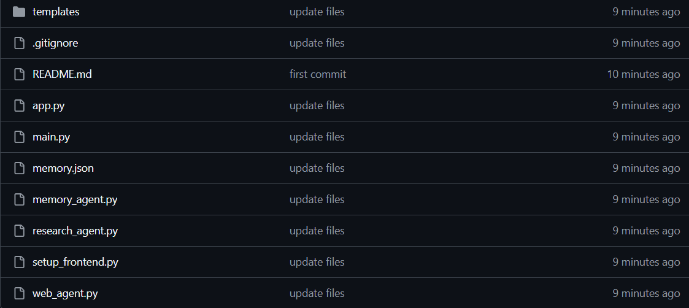
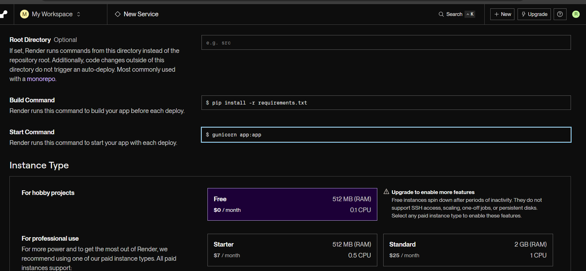
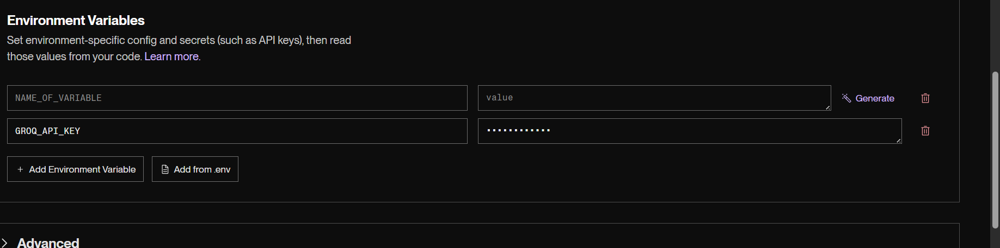
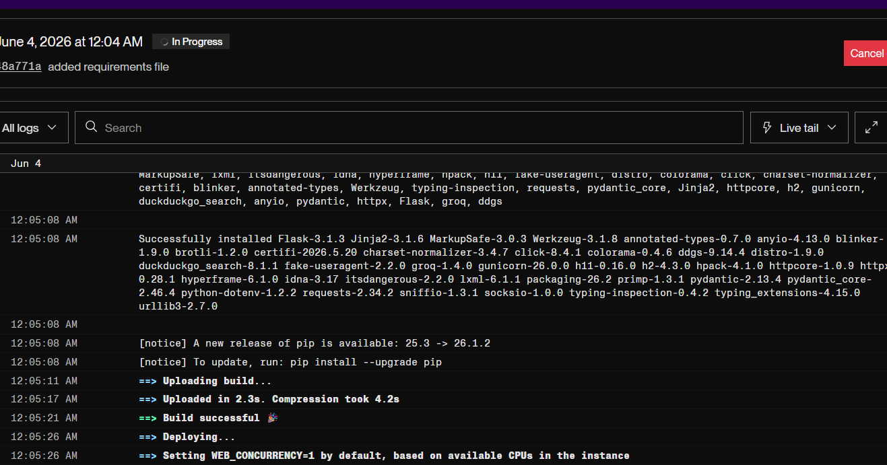

## Step 1 — Create a Render Account

Today we'll deploy our AI Research Agent to the internet using Render.

Render is a cloud platform that can host Python applications and give us a public URL anyone can access.

1. Open your browser
2. Go to Render
3. Click **Sign Up**
4. Choose **Continue with GitHub**
5. Authorize Render to access your GitHub account

After signing in, you should see your Render dashboard.

### Why Are We Using Render?

- Free hosting tier
- Easy GitHub integration
- Automatic deployments
- Perfect for beginner AI projects


## Step 2 — Verify Your GitHub Repository

Before deploying, make sure your project is uploaded to GitHub.

Open your GitHub repository and verify that these files are present:



``

If you recently made changes, push them first:

```cmd
git add .
git commit -m "Ready for deployment"
git push
```

Once GitHub shows your latest files, you're ready to connect the repository to Render.


## Step 3 — Connect GitHub to Render

Now we'll connect Render to the GitHub repository that contains our AI Research Agent.

1. In the Render dashboard, click **New**
2. Select **Web Service**
3. Click **Connect GitHub**
4. If prompted, authorize Render to access your repositories
5. Find your repository:

```text
ai-agent-course
```

6. Click **Connect**

Render will now read your code directly from GitHub.

Any future changes you push to GitHub can be deployed automatically.

> 📸 **Screenshot here:** Show the repository selection screen with `ai-agent-course` connected.


## Step 4 — Configure Your Web Service

After connecting your repository, Render will ask for deployment settings.


Fill in the following values:

| Setting | Value |
|----------|----------|
| Name | rohi-research-agent |
| Runtime | Python 3 |
| Build Command | `pip install -r requirements.txt` |
| Start Command | `gunicorn app:app` |

These settings tell Render:

- How to install your project dependencies
- Which file contains your Flask application
- How to start your web server

Double-check everything before continuing.




## Step 5 — Add Your Environment Variables

Your AI application needs access to your Groq API key.

For security reasons, API keys should never be stored directly in your code or uploaded to GitHub.

In Render:

1. Scroll down to **Environment Variables**
2. Click **Add Environment Variable**
3. Enter the following:

| Key | Value |
|-------|-------|
| GROQ_API_KEY | Your Groq API Key |

4. Click **Save Changes**

Render will securely store the key and make it available to your application when it runs.

### Why This Matters

Without this environment variable:

```text
Groq Authentication Error
```

Your AI agent will not be able to generate reports.




## Step 6 — Deploy Your Application

Everything is now configured.

Click:

```text
Create Web Service
```

Render will now:

1. Clone your GitHub repository
2. Install all libraries from `requirements.txt`
3. Start your Flask application
4. Generate a public URL

Deployment usually takes:

```text
2–5 minutes
```

You can watch the deployment logs in real time.

When deployment is successful, you'll see a message similar to:

```text
Your service is live 🎉
```

and a public URL like:

```text
https://ai-agent-skng.onrender.com
```


---

## 🎉 Congratulations

Seven days ago, you started with an empty folder.

Today, you have:

- Built AI applications with Groq
- Added memory to an AI agent
- Connected tools like web search and file reading
- Created a Research Agent
- Built a Flask web application
- Pushed code to GitHub
- Deployed your project to the internet

Most people consume AI.

You built with it.

This is only the beginning.

Keep building.
Keep experimenting.
Keep shipping projects.

Every real AI engineer started exactly where you are now.

---

### 🚀 What's Next?

The best way to improve is to build.

Some project ideas:

- AI Resume Reviewer
- AI Study Assistant
- AI Content Generator
- AI Customer Support Agent
- AI Research Assistant

Pick one.

Build it.

Deploy it.

Share it.

Then build the next one.

---

Thank you for following the **RohithBuilds AI Agent Course**.

See you in the next Course  🤖


```python

```
